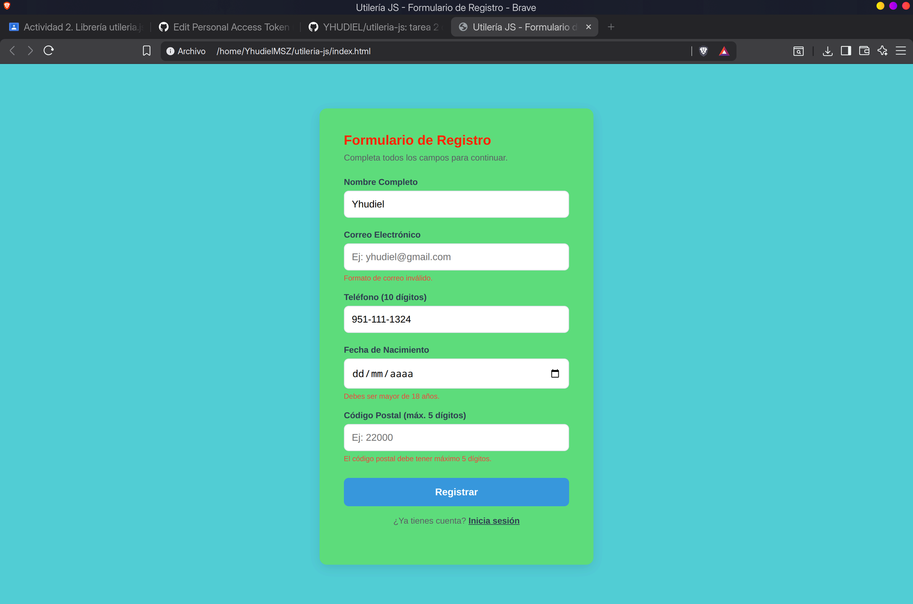
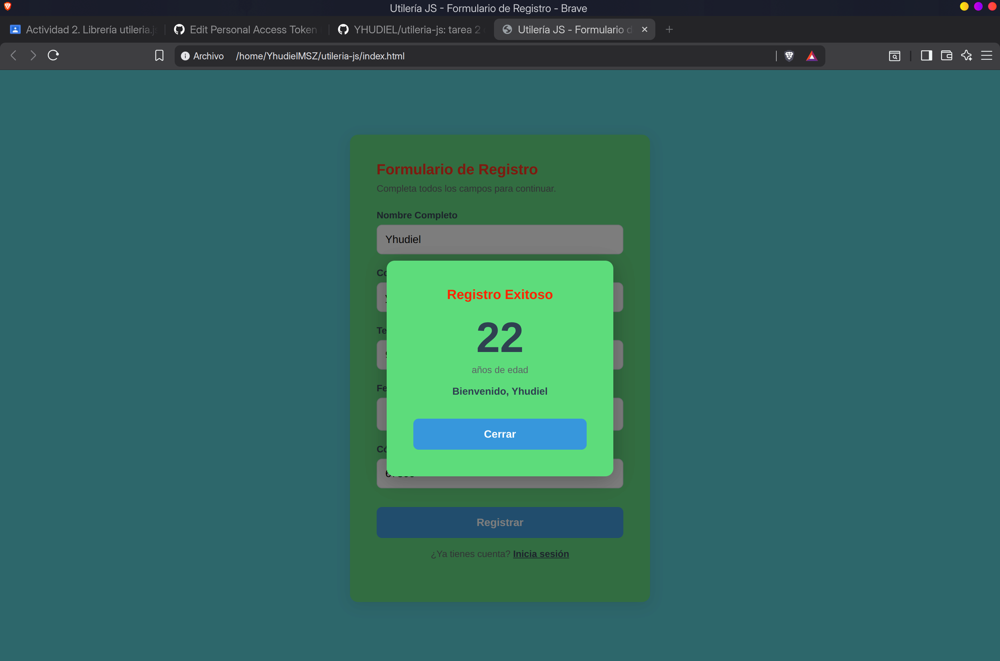
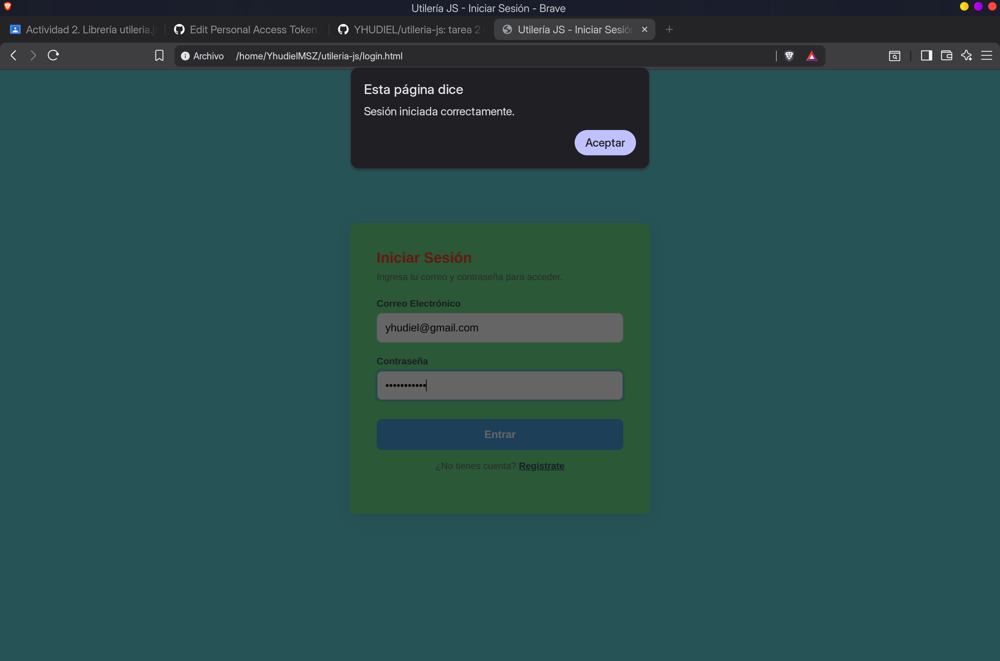

# Utilería JS

**Yhudiel Mendoza Sanchez**  
Programación Web — Tarea 2


---

## Funciones

### `validarCorreo(correo)`
Valida que el correo tenga un formato correcto.

```js
validarCorreo("yhudiel@gmail.com"); // true
validarCorreo("correo_malo");       // false
```

---

### `soloLetras(texto)`
Verifica que el texto solo tenga letras, incluyendo acentos y ñ.

```js
soloLetras("María");    // true
soloLetras("Juan123"); // false
```

---

### `validarLongitud(numero, maxLongitud)`
Revisa que un número no tenga más dígitos del máximo permitido.

```js
validarLongitud(22000, 5);  // true
validarLongitud(220001, 5); // false
```

---

### `calcularEdad(fechaNacimiento)`
Calcula la edad exacta en años a partir de la fecha de nacimiento.

```js
calcularEdad("2004-11-15"); // 21
```

---

### `esMayorDeEdad(fechaNacimiento)`
Devuelve `true` si la persona tiene 18 años o más.

```js
esMayorDeEdad("2004-11-15"); // true
esMayorDeEdad("2015-06-01"); // false
```

---

### `validarPassword(password)`
Valida que la contraseña tenga mínimo 8 caracteres, mayúscula, minúscula, número y carácter especial.

```js
validarPassword("MiPass1!"); // true
validarPassword("password"); // false
```

---

### `formatearTelefono(telefono)`
Toma un número de 10 dígitos y lo devuelve en formato `XXX-XXX-XXXX`. Útil para mostrar teléfonos de forma legible.

```js
formatearTelefono("9511234567");    // "951-123-4567"
formatearTelefono("(951)123-4567"); // "951-123-4567"
formatearTelefono("123");           // ""
```

---

### `obtenerRegionOaxaca(lada)`
Identifica la región del estado de Oaxaca a partir de los primeros 3 dígitos del número de teléfono (lada). Útil para saber de qué parte del estado es un contacto.

```js
obtenerRegionOaxaca("951"); // "Valles Centrales (Oaxaca de Juárez)"
obtenerRegionOaxaca("971"); // "Istmo de Tehuantepec (Juchitán / Tehuantepec)"
obtenerRegionOaxaca("954"); // "Costa (Puerto Escondido / Pinotepa Nacional)"
obtenerRegionOaxaca("000"); // "Región no identificada"
```

Ladas reconocidas:

| Lada | Región |
|------|--------|
| 951  | Valles Centrales |
| 971  | Istmo de Tehuantepec |
| 953  | Cañada |
| 954  | Costa |
| 959  | Sierra Sur |
| 924  | Mixteca |
| 272  | Sierra Norte |

---

### `capitalizarNombre(nombre)`
Pone en mayúscula la primera letra de cada palabra. Sirve para normalizar nombres ingresados por el usuario.

```js
capitalizarNombre("yhudiel mendoza"); // "Yhudiel Mendoza"
capitalizarNombre("JUAN PÉREZ");      // "Juan Pérez"
```

---

## Capturas de pantalla

**Validaciones en tiempo real — el formulario muestra errores por campo:**



**Modal con la edad calculada al registrarse correctamente:**



**Login con validación de correo y contraseña:**



